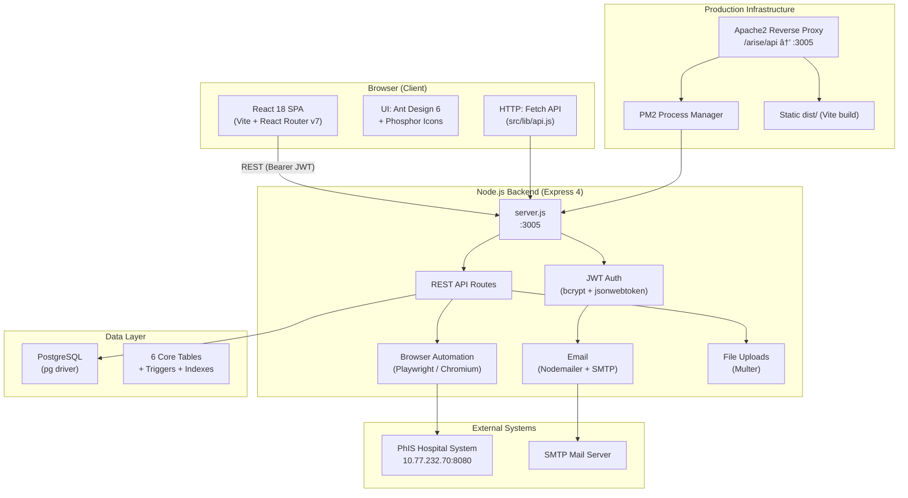
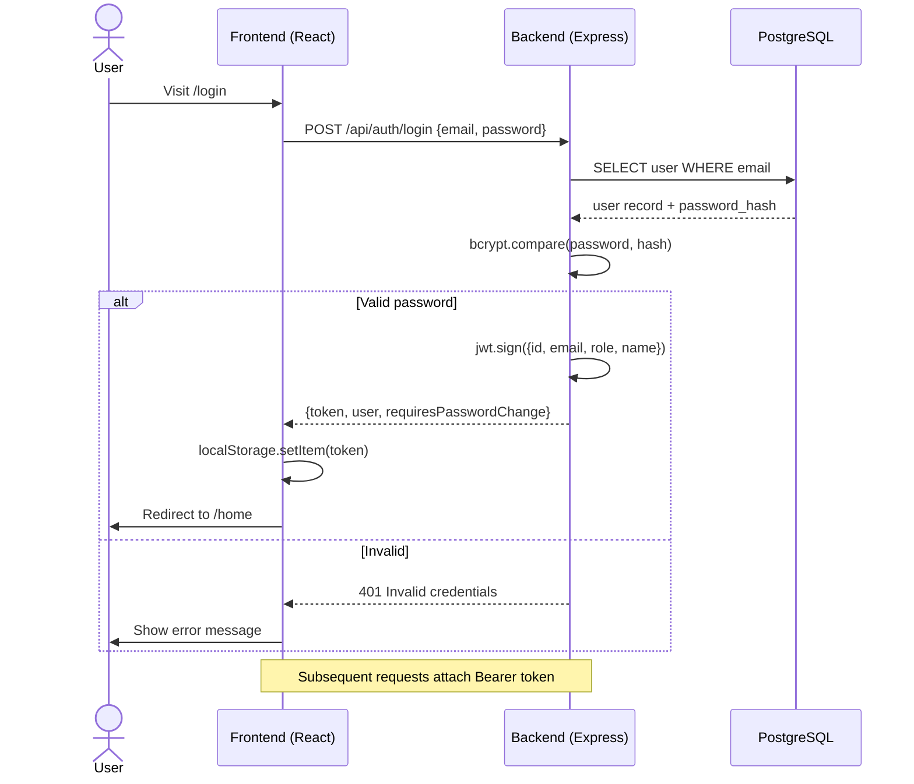
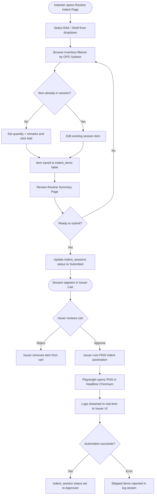
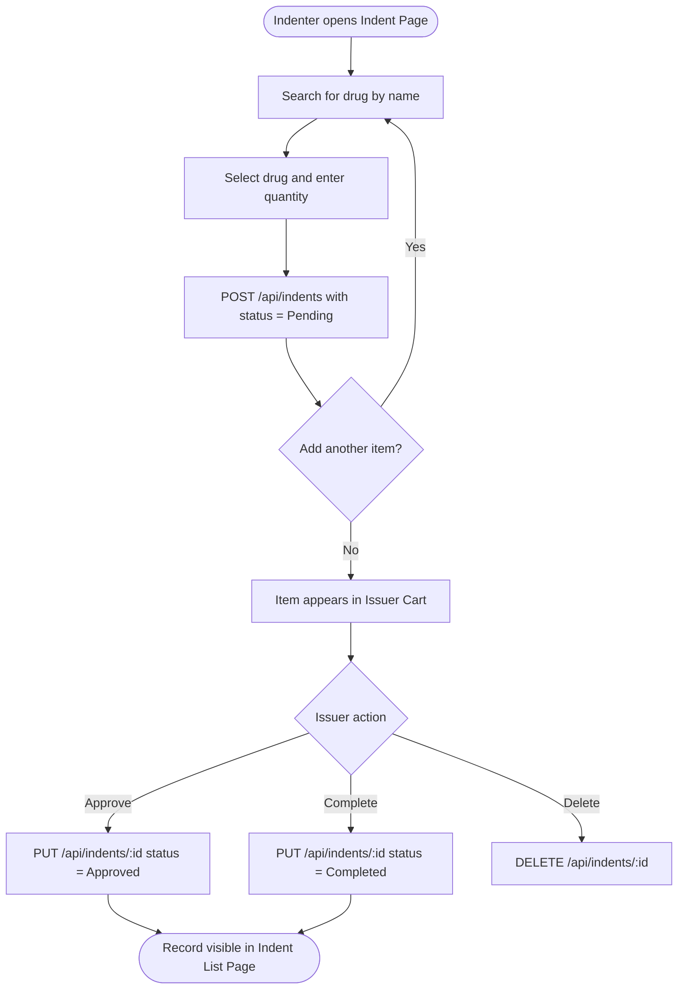
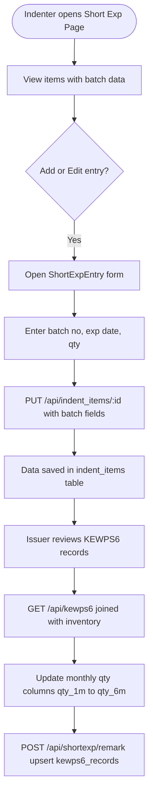
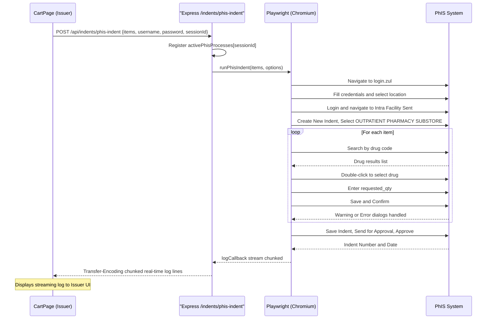
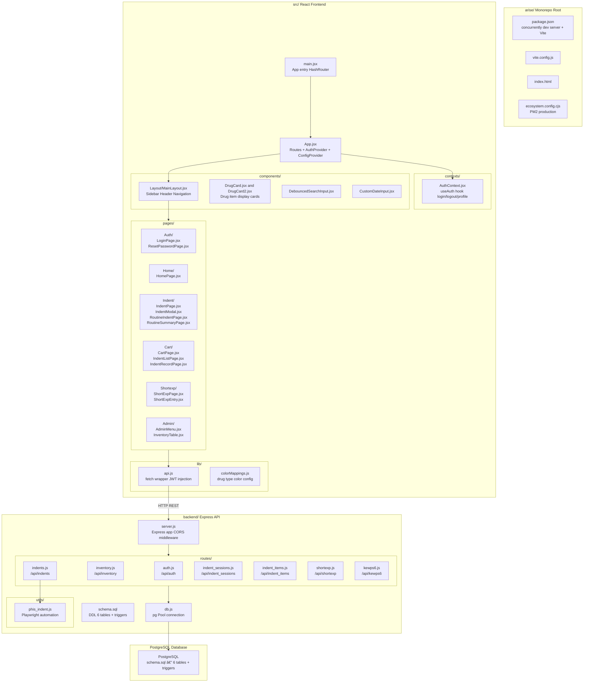
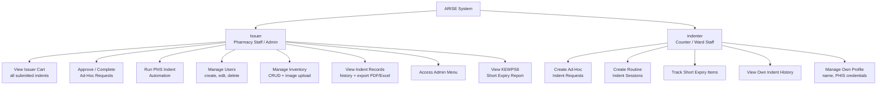
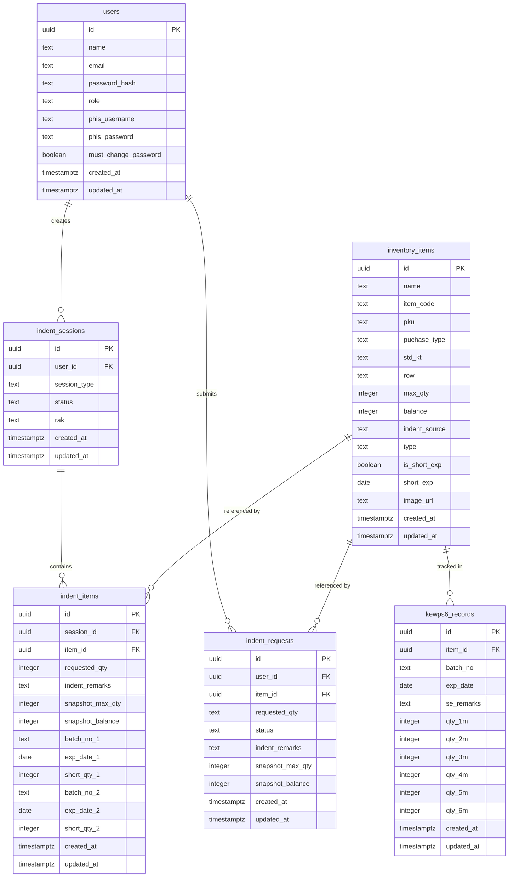

# ARISE — Architecture Documentation
`AGILE RESTOCK INVENTORY SURVEILLANCE ENGINE`

> **ARISE** (Automated Requisition & Inventory System for Emergency Pharmacy)
> Emergency Pharmacy Hospital Segamat — Pharmacy Inventory Management System

---

## Table of Contents

1. [Technology View](#1-technology-view)
2. [Process Workflow](#2-process-workflow)
3. [Application Structure View](#3-application-structure-view)
4. [Business Hierarchy](#4-business-hierarchy)
5. [List of Modules and Their Functions](#5-list-of-modules-and-their-functions)

---

## 1. Technology View

ARISE is a full-stack monorepo web application composed of a **React/Vite frontend**, a **Node.js/Express REST API backend**, and a **PostgreSQL relational database**. In production it is served via PM2 and Apache2 as a reverse proxy.

### Tech Stack Summary

| Layer | Technology | Version |
|-------|-----------|---------|
| Frontend Framework | React | 18.3 |
| Build Tool | Vite | 7.x |
| Routing | React Router DOM | 7.10 |
| UI Component Library | Ant Design | 6.x |
| Icon Libraries | Phosphor Icons, Ant Design Icons | latest |
| HTTP Client | Fetch API (custom wrapper) | native |
| Date Handling | Day.js | 1.11 |
| PDF Export | jsPDF + jspdf-autotable | 3.x / 5.x |
| Excel Export | xlsx (SheetJS) | 0.18 |
| Backend Runtime | Node.js (ESM) | — |
| Backend Framework | Express | 4.x |
| Authentication | JWT (jsonwebtoken) + bcrypt | — |
| Database Driver | node-postgres (pg) | 8.x |
| File Upload | Multer | 1.x |
| Email | Nodemailer | 8.x |
| Browser Automation | Playwright (Chromium) | 1.61 |
| Database | PostgreSQL | — |
| Process Manager | PM2 | — |
| Dev Tooling | nodemon, concurrently | — |

---

## 2. Process Workflow

### 2.1 — Authentication Flow

### 2.2 — Routine Indent Workflow

### 2.3 — Ad-Hoc Indent Workflow

### 2.4 — Short Expiry Tracking Workflow

### 2.5 — PhIS Automation Process

---

## 3. Application Structure View

---

## 4. Business Hierarchy

### 4.1 — User Role Hierarchy

### 4.2 — Data Entity Relationship Diagram

---

## 5. List of Modules and Their Functions

### 5.1 — Frontend Modules

#### `src/main.jsx`
Entry point. Bootstraps the React app inside `<HashRouter>`.

#### `src/App.jsx`
- Defines all application routes via `<Routes>`.
- Wraps app in `<AuthProvider>` and Ant Design `<ConfigProvider>`.
- Implements `<ProtectedRoute>` — redirects unauthenticated users to `/login` and enforces Issuer-only routes via `requireIssuer` prop.

#### `src/contexts/AuthContext.jsx`
Global authentication state manager (React Context).

| Function | Description |
|----------|-------------|
| `login(email, password)` | Calls `POST /auth/login`, stores JWT in localStorage, sets user state |
| `signOut()` | Clears token and user state |
| `resetPassword(email)` | Calls `POST /auth/reset-password` to trigger temp password email |
| `changePassword(newPassword)` | Calls `POST /auth/change-password` for logged-in user |
| `updateProfile(values)` | Calls `PUT /auth/profile`, merges returned user data into state |
| `fetchProfile()` | Calls `GET /auth/me` to restore session on page load |
| `isIssuer` | Computed boolean: `user.role === 'Issuer'` |
| `isIndenter` | Computed boolean: `user.role === 'Indenter'` |

#### `src/lib/api.js`
Thin `fetch` wrapper that:
- Injects `Authorization: Bearer <token>` on every request.
- Handles `Content-Type: application/json` vs `FormData` automatically.
- Throws descriptive errors on non-OK responses.
- Dev base URL: `http://localhost:3005/api` | Prod: `/arise/api`

#### `src/lib/colorMappings.js`
Maps drug `type` values (OPD, DDA, Injection, etc.) to Ant Design color tokens for DrugCard rendering.

#### `src/components/Layout/MainLayout.jsx`
Application shell using Ant Design `<Layout>`.
- Collapsible sidebar with role-aware navigation (Cart and Admin visible to Issuers only).
- User avatar dropdown: Profile edit, Change Password, PhIS credentials, Logout.
- Forces password-change modal if `user.requiresPasswordChange` is true.

#### `src/components/DrugCard.jsx` / `DrugCard2.jsx`
Reusable drug item display cards. Renders drug name, type badge (color-coded), current balance, max qty, and an action button (Add to Indent / Add to Session).

#### `src/components/DebouncedSearchInput.jsx`
Input with configurable debounce delay to reduce API calls while the user types.

#### `src/components/CustomDateInput.jsx`
Lightweight custom date input wrapping the native HTML date input for form use.

---

#### Page Modules

| Page | Route | Access | Description |
|------|-------|--------|-------------|
| `LoginPage.jsx` | `/login` | Public | Email/password login form; password reset trigger |
| `ResetPasswordPage.jsx` | `/reset-password` | Public | Landing page after password reset email |
| `HomePage.jsx` | `/home` | Both | Dashboard; shows active draft sessions; draft cleanup utility |
| `IndentPage.jsx` | `/indent` | Both | Browse inventory by source/type; opens IndentModal to create ad-hoc requests |
| `IndentModal.jsx` | (modal) | Both | Modal for entering quantity + remarks for a selected drug; POSTs to indent_requests |
| `RoutineIndentPage.jsx` | `/routine-indent` | Both | Select RAK, add/edit items within a routine indent session |
| `RoutineSummaryPage.jsx` | `/routine-summary` | Both | Review and submit the complete routine indent session to Issuer |
| `CartPage.jsx` | `/cart` | Issuer only | View all pending sessions and ad-hoc requests; trigger PhIS automation with live log streaming; PDF/Excel export |
| `IndentRecordPage.jsx` | `/indent-list` | Both | View and filter Approved/Completed indent records; export to PDF |
| `ShortExpPage.jsx` | `/shortexp` | Both | List all drug entries with short-expiry batch data recorded |
| `ShortExpEntry.jsx` | `/shortexp-entry` | Both | Add/edit batch number, expiry date, and qty for short-expiry tracking |
| `AdminMenu.jsx` | `/admin` | Issuer only | User management: create, edit role, assign PhIS credentials, delete |
| `InventoryTable.jsx` | `/admin` (tab) | Issuer only | Full inventory CRUD with image upload; filter by indent_source, type, search |

---

### 5.2 — Backend Modules

#### `backend/server.js`
Express application entry point.
- Configures CORS and JSON body parser middleware.
- Serves uploaded files as static assets from `/uploads`.
- Mounts all 7 route modules.
- Provides a health check endpoint at `GET /api/health`.
- Global error-handling middleware (500 fallback).
- Listens on `PORT` env variable (default: 3005).

#### `backend/db.js`
Exports a `pg.Pool` instance for PostgreSQL connections using `DATABASE_URL` from `.env`.

---

#### `backend/routes/auth.js` — `/api/auth`

| Endpoint | Method | Auth | Function |
|----------|--------|------|----------|
| `/register` | POST | No | Create user with bcrypt-hashed password; returns new user record |
| `/login` | POST | No | Validate credentials + temp password; issue JWT (1 day expiry) |
| `/reset-password` | POST | No | Generate random temp password; send via Nodemailer SMTP |
| `/change-password` | POST | JWT | Hash and save new password; clear temp_password_hash |
| `/profile` | PUT | JWT | Update name, phis_username, phis_password for logged-in user |
| `/me` | GET | JWT | Return full profile of logged-in user |
| `/users` | GET | JWT | List all users for Admin panel |
| `/users/:id` | PUT | JWT | Admin: update any user's fields |
| `/users/:id` | DELETE | JWT | Admin: delete user by ID |
| `authenticateToken` | Middleware | — | Exported JWT verification middleware used across all routes |

---

#### `backend/routes/inventory.js` — `/api/inventory`

| Endpoint | Method | Auth | Function |
|----------|--------|------|----------|
| `/` | GET | JWT | List inventory; supports `indent_source`, `row`, `search` query filters |
| `/raks` | GET | JWT | Get distinct shelf row values for OPD Substor |
| `/:id` | GET | JWT | Fetch single inventory item |
| `/` | POST | JWT | Create inventory item; supports optional image upload via Multer |
| `/:id` | PUT | JWT | Update inventory item; supports optional image replacement |
| `/:id` | DELETE | JWT | Delete inventory item |

---

#### `backend/routes/indents.js` — `/api/indents`

| Endpoint | Method | Auth | Function |
|----------|--------|------|----------|
| `/` | GET | JWT | List all indent_requests joined with inventory details |
| `/` | POST | JWT | Create ad-hoc indent request (status: Pending) |
| `/:id` | PUT | JWT | Update request status or quantity |
| `/:id` | DELETE | JWT | Delete indent request |
| `/cart` | GET | JWT | Issuer Cart: all Submitted sessions + Pending requests with user + inventory data |
| `/records` | GET | JWT | History view: Submitted/Approved/Completed sessions and Approved/Completed requests |
| `/approved` | GET | JWT | Get approved requests within a date range |
| `/approved-dates` | GET | JWT | Get all unique approval timestamps |
| `/batch-update` | POST | JWT | Batch update status for multiple requests by ID array |
| `/phis-indent` | POST | JWT | Trigger PhIS automation; streams log output as chunked text response |
| `/abort-phis-indent` | POST | JWT | Abort an in-progress PhIS session by sessionId |

---

#### `backend/routes/indent_sessions.js` — `/api/indent_sessions`

| Endpoint | Method | Auth | Function |
|----------|--------|------|----------|
| `/draft` | GET | JWT | Get latest Draft session for user filtered by session_type |
| `/` | POST | JWT | Create a new indent session (with session_type, status, rak) |
| `/:id` | PUT | JWT | Update session rak or status |
| `/delete-batch` | POST | JWT | Delete multiple sessions by ID array (bulk draft cleanup) |
| `/drafts/cleanup` | DELETE | JWT | Remove all Draft sessions of a given session_type for the user |

---

#### `backend/routes/indent_items.js` — `/api/indent_items`

| Endpoint | Method | Auth | Function |
|----------|--------|------|----------|
| `/` | GET | JWT | List items by session_id or multiple session_ids; optional item_id filter |
| `/shortexp/:item_id` | GET | JWT | Get latest short-expiry record (batch fields populated) for an item |
| `/` | POST | JWT | Add drug line to a session with qty, remarks, and batch/expiry fields |
| `/:id` | PUT | JWT | Update item qty, remarks, and all batch/expiry fields |
| `/:id` | DELETE | JWT | Remove a single item from a session |
| `/delete-batch` | POST | JWT | Remove all items belonging to given session_ids |

---

#### `backend/routes/shortexp.js` — `/api/shortexp`

| Endpoint | Method | Auth | Function |
|----------|--------|------|----------|
| `/` | GET | JWT | Return indent_items with batch data + all kewps6_records |
| `/remark` | POST | JWT | Upsert (insert or update) a KEWPS6 record for a given item + batch combination |

---

#### `backend/routes/kewps6.js` — `/api/kewps6`

| Endpoint | Method | Auth | Function |
|----------|--------|------|----------|
| `/` | GET | JWT | List all KEWPS6 records joined with inventory_items, sorted by exp_date ASC |
| `/:id` | PUT | JWT | Dynamically update any set of fields on a KEWPS6 record |

---

### 5.3 — Utility Modules

#### `backend/utils/phis_indent.js` — `runPhisIndent(items, options)`

Playwright Chromium automation engine that performs the full indent lifecycle in the PhIS hospital system:

1. Launches headless Chromium browser.
2. Navigates to PhIS login at `http://10.77.232.70:8080/iphis/login.zul`.
3. Fills user credentials and selects `Outpatient Pharmacy Counter` location.
4. Navigates: Inventory → Inventory Management → Distribution → Indent → Intra Facility (Sent).
5. Creates a new indent directed to `OUTPATIENT PHARMACY SUBSTORE`.
6. For each drug item: searches by `item_code`, double-clicks result, sets `requested_qty`, saves with Yes confirmation.
7. Handles edge cases: item not found (skip + log), max qty exceeded (skip + log), back-order warning (acknowledge + continue).
8. After all items: saves indent, sends for approval, and approves — retrieving the final Indent Number and Date.
9. All progress is streamed in real-time via `logCallback` back to the Express chunked response.
10. Supports graceful abort mid-run via `options.isAborted` flag and `options.browser.close()`.

---

### 5.4 — Database Schema Summary

| Table | Status Lifecycle | Purpose |
|-------|-----------------|---------|
| `users` | — | System users with role (Issuer/Indenter) and stored PhIS credentials |
| `inventory_items` | — | Master drug/item catalogue: balance, max qty, indent source, expiry flags, image |
| `indent_sessions` | Draft → Submitted → Approved | Groups drug lines into a routine indent batch per user |
| `indent_items` | — | Individual drug lines within a session; also stores short-expiry batch data |
| `indent_requests` | Pending → Approved → Completed | Ad-hoc single-drug requests outside sessions |
| `kewps6_records` | — | Monthly short-expiry quantity tracking (KEWPS6 government form) per drug/batch |

All tables have `created_at` and `updated_at` timestamp columns managed by PostgreSQL triggers.

**Indent Source Values:** OPD Kaunter, OPD Substor, IPD Kaunter, MNF Substor, MNF Eksternal, MNF Internal, Prepacking, IPD Substor, HPSF Muar

**Drug Type Values:** OPD, Eye/Ear/Nose/Inh, DDA, External, Injection, Syrup, Others, UOD, Non-Drug

---

*Generated by Antigravity — ARISE Architecture Analysis*
